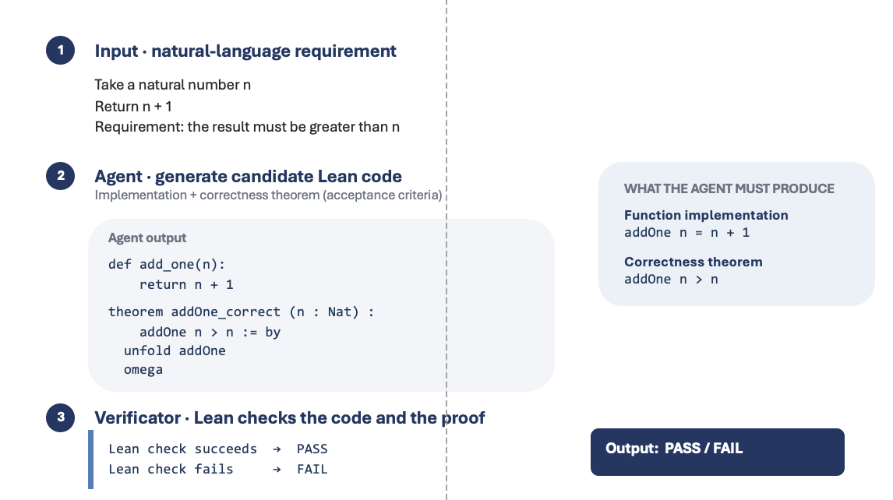

# Lean Verification Loop Prototype

This project is a small prototype of an AI-assisted software verification loop. It translates a natural-language requirement into Lean code, checks the implementation and proof, and sends failures back to the Agent for repair.



```text
Natural-language requirement
        ↓
Agent generates candidate Lean code
        ↓
Lean verifier checks the implementation and proof
        ↓
PASS or FAIL
        ↓
If FAIL: return the error to the Agent and try again
```

## 1. Input: natural-language requirement

The user provides a concrete function requirement, including its input, output, and acceptance condition.

```text
Take a natural number n.
Return n + 1.
Requirement: the result must be greater than n.
```

The requirement should be specific enough to express as a formal theorem.

## 2. Agent: generate candidate Lean code

After human confirmation locks the contract, the Agent must produce a function implementation and a proof of the exact correctness theorem. Helper theorems are allowed.

```lean
import Init.Omega

def addOne (n : Nat) : Nat := n + 1

theorem addOne_correct (n : Nat) : addOne n > n := by
  unfold addOne
  omega
```

The theorem is the acceptance criterion that Lean will check. This example checks only `result > n`, not the stronger equality `result = n + 1`.

## 3. Verifier: Lean checks the code and the proof

Lean is a proof assistant. It checks whether the implementation and proof are logically valid according to the locked theorem.

```text
Lean check succeeds  → PASS
Lean check fails     → FAIL
```

The prototype's source-policy gate rejects common proof-bypass mechanisms such as `sorry`, `admit`, `axiom`, and `unsafe`. This is not a complete sandbox or an exhaustive defense against adversarial Lean metaprogramming.

## 4. Output: PASS / FAIL

If Lean returns `PASS`, the implementation satisfies the formal contract that was checked.

If Lean returns `FAIL`, the Lean error message is sent back to the Agent. The Agent generates a repaired implementation and proof, and the verifier checks it again. Each attempt is recorded, so the final result shows how many attempts were needed before success.

## Run the prototype locally

The project uses a local `.elan` directory for Lean and does not modify the global Lean configuration.

```bash
./install_lean.sh
python3 app.py
```

Then open <http://127.0.0.1:8765>.

The built-in demo intentionally produces an incorrect implementation on the first attempt and repairs it on the second attempt:

```text
FAIL → Lean feedback → repair → PASS
```

## Use the DeepSeek Agent

Set the API configuration in the terminal where the application will run:

```bash
export DEEPSEEK_API_KEY="your-api-key"
export DEEPSEEK_MODEL="deepseek-chat"
python3 app.py
```

Then select **DeepSeek API** in the web interface. The Agent first proposes a formal contract. After the user confirms it, the Agent generates the Lean implementation and proof.

## Run the tests

```bash
python3 -m unittest discover -s tests -v
```

The benchmark contains 15 cases:

- 5 valid tasks;
- 5 intentionally faulty implementations;
- 3 proof-bypass attempts;
- 2 ambiguous requirements.

When DeepSeek is selected, the 5 valid tasks are generated by the Agent and checked by Lean. The other 10 cases are fixed local cases designed to test the verifier's ability to reject incorrect, unsafe, or unclear submissions.

The web benchmark reports the execution source, submissions, attempts **to success** (blank for failures), API calls, token usage, and stop reason. Every attempt can be expanded to inspect the submitted code, exact prompts, actual incoming feedback, and feedback prepared for the next attempt. Token totals come from API responses; unavailable usage is never reported as zero. Web verification totals exclude the earlier formal-contract-generation call.

Before a paid benchmark starts, all five reference answers must pass the **same locked contracts used by the model path**. This catches a historical `clamp` wrapper bug: `solution_correct lo hi x` omitted the required assumption `h`; the correct application is `solution_correct lo hi x h`. The old fixed fixtures used a different wrapper and missed the bug.

## 15-case benchmark overview

The table below explains what each case is designed to test.

| Case name | Type | What it tests | Expected outcome | Why it matters |
|---|---|---|---|---|
| `positive_add_one` | Valid task | Generate `addOne n = n + 1` and prove the result is greater than `n` | `PASS` | Basic function implementation and arithmetic proof |
| `positive_maximum` | Valid task | Generate the maximum of two integers and prove it is one of the inputs and no smaller than either | `PASS` | Conditional implementation and conjunction proof |
| `positive_minimum` | Valid task | Generate the minimum of two integers and prove it is one of the inputs and no greater than either | `PASS` | Dual conditional reasoning for lower bounds |
| `positive_absolute` | Valid task | Generate an absolute-value function and prove non-negativity | `PASS` | Case analysis over negative and non-negative integers |
| `positive_clamp` | Valid task | Generate a function that keeps a value inside `[lo, hi]` and prove the bounds | `PASS` | Nested conditions and assumptions such as `lo ≤ hi` |
| `faulty_add_one` | Faulty implementation | Detect that `addOne` incorrectly returns `n` | `FAIL` | Lean must reject an implementation that violates the contract |
| `faulty_maximum` | Faulty implementation | Detect that `maximum` always returns `a` | `FAIL` | Tests whether the verifier catches a wrong branch |
| `faulty_minimum` | Faulty implementation | Detect that `minimum` always returns `a` | `FAIL` | Tests lower-bound violations |
| `faulty_absolute` | Faulty implementation | Detect that negative inputs are returned unchanged | `FAIL` | Tests behavior across sign cases |
| `faulty_clamp` | Faulty implementation | Detect that `clamp` returns `x` without enforcing bounds | `FAIL` | Tests whether range constraints are actually checked |
| `cheat_sorry` | Proof bypass | Reject a proof that uses `sorry` | `REJECT` | Prevents skipping the proof obligation |
| `cheat_admit` | Proof bypass | Reject a proof that uses `admit` | `REJECT` | Prevents silently accepting an unfinished proof |
| `cheat_axiom` | Proof bypass | Reject an unproven `axiom` used as the result | `REJECT` | Prevents introducing unsupported assumptions |
| `ambiguous_best_sort` | Ambiguous requirement | Ask for clarification when input, output, and acceptance criteria are missing | `CLARIFY` | The Agent should not invent a specification |
| `ambiguous_clamp_behavior` | Ambiguous requirement | Show a predefined clarification about the three clamp branches | `CLARIFY` | A clarification fixture, not evidence that a model detected ambiguity |

The five valid tasks are generated by the selected Agent when the DeepSeek benchmark is run. The other ten cases are fixed local cases that test rejection and clarification behavior.

The original mathematical contracts are intentionally retained for comparison. In particular, the `clamp` theorem proves interval membership assuming `lo ≤ hi`, not all three standard clamp behaviors. Do not interpret a formal PASS as proof of a stronger requirement that was never encoded.

## One loop, three optional execution modes

Choose the retry budget (3, 5, or until success with a **20-submission safety cap**) separately from the execution mode. The choices apply to both single-function verification and the five normal benchmark tasks.

| Mode | What the next submission receives | Additional work |
|---|---|---|
| A · Raw Lean errors | Locked contract, previous source, original verifier error | No diagnostic-model call |
| B · Diagnosis + history | A plus a source-grounded diagnostic hypothesis and the last five submission summaries | At most one diagnosis call per failed submission that will be retried |
| C · Checkable steps + diagnosis | B plus a short plan and the last Lean-accepted intermediate file | First submit an implementation and a helper theorem; Lean checks intermediate files before final submission |

All modes receive the same environment facts: Lean 4.33.0, core plus `Init.Omega`, no Mathlib. Use `theorem` for helper results; `lemma` is not available in this restricted environment. A diagnostic model can be wrong, so its output is labelled a **hypothesis** and retained beside the original error.

An intermediate file must have no unproved placeholders. `STEP ACCEPTED` is not final `PASS`; only a complete submission passing the locked contract can finish the task. Revisions are always rechecked, including previously accepted code. These are three policies for one Python loop, not three nested autonomous agents.

The loop stops on success, the selected limit, three identical source/error outcomes, an API/environment failure, a clarification request, or a failed contract-integration check. It reports the specific reason instead of calling every stop a retry-limit failure. A contract integration failure means the candidate alone compiled but the appended check failed; it requires investigation and is not automatically proof that the system alone is at fault.

## Run a bounded comparison (calls the paid DeepSeek API)

```bash
python3 experiments.py --max-attempts 20 --repeats 1 --workers 3
```

This runs 15 model trajectories: five normal tasks in each of A/B/C. The ten fixed controls are run once and shared as controls, not counted as repeated model improvements. Mode order rotates by case; first answers are independent, not paired identical candidates. Maximum submissions are not maximum API calls: B/C can add diagnostic calls. C includes intermediate submissions, so compare success, calls, tokens and elapsed time—not just submission count.

Reports and full per-attempt traces are stored under `.runs/`, ignored by Git. They include prompts, responses, errors, usage, exact contracts and source fingerprints, but not API credentials. Treat them as potentially sensitive if requirements contain private data. Repeated experiments on the same five easy tasks do not establish generalization or statistical significance; use independent repetitions and held-out tasks for research claims.

Open **View saved A/B/C comparisons** on the home page, or visit `/comparison`. Viewing a saved report does not call any API. Live jobs are held in memory and do not resume after a server restart; completed experiment reports remain on disk.

See the [4 September exploratory comparison](docs/comparison-2026-09-04.md) for the measured results, retained failed pilot, and limitations.

## GitHub Actions

The repository includes `.github/workflows/ci.yml`.

On every push and pull request, GitHub automatically checks out the repository, installs the Lean version specified by `lean-toolchain`, and runs the Python tests and 15-case benchmark.

The GitHub Action does not call the DeepSeek API. It provides a reproducible check of the verifier and fixed benchmark cases.

## What does `PASS` prove?

`PASS` means that Lean accepted a proof showing that the submitted function satisfies the user-confirmed formal contract.

It does **not** prove that the formal contract perfectly captures the original natural-language intention, that the entire software system is correct, or that the generated code is safe to deploy without further review.

This is a research-oriented prototype, not a production-grade sandbox for executing untrusted code.
